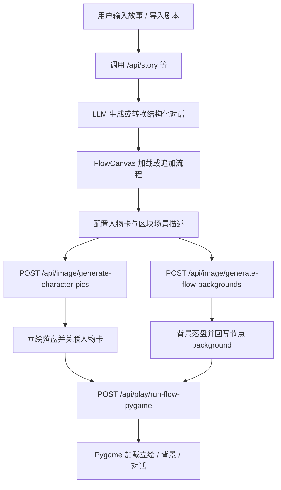

# Ren'Ai 视觉小说零代码开发平台 — 项目说明书

面向「故事 → 结构化剧本 → 可视化流程 → AI 立绘/场景 → 本地预览」的一站式工作台：**以流程图为单一事实来源**，将 LLM、RunningHub / ComfyUI 生图与 Pygame 预览串成闭环，降低视觉小说创作的技术门槛。

## 演示视频

[Bilibili：Ren'Ai 项目演示](https://www.bilibili.com/video/BV1edXTBCEYL)

## 本项目特点（概览）

| 维度 | 说明 |
|------|------|
| **流程即剧本** | 使用 **Vue Flow** 编排区块与对话节点；块内 **Dagre** 自动排版；支持 `parent_id` / `children`、`checkFlag`、`menu`、跨块引用 `g组号:节点ID` 等导出为可执行结构化 JSON。 |
| **双通道生图** | 立绘与流程背景既可走 **RunningHub**，也可在设置中切换为 **本地 ComfyUI**（工作流、尺寸比例、Checkpoint 可配）。 |
| **人物与流程联动** | 人物卡页（SillyTavern 兼容）管理立绘；流程侧展示剧中角色名并与本地人物卡比对，便于查漏补缺。 |
| **导入与持久化** | 支持流程图 JSON、对话剧本 JSON（`chapter_name` / `site` / `dialogues`）；导航栏导入为 **追加到当前画布**；流程草稿写入 **localStorage**。 |
| **场景背景批次** | 后端列出 `public/pic_bg` 下时间戳文件夹；前端下拉选择批次后，按区块顺序将 `地点1.png`、`地点2.png`… 写回对应区块内所有对话节点的「背景」字段；**一键生成背景** 完成后自动刷新列表并选中新文件夹。 |
| **零安装预览剧本** | 后端将当前画布导出为结构化 JSON 并启动 **Pygame** 预览（需本机安装 `pygame`），快速验证分支与资源路径。 |

更多接口与 RunningHub 细节见仓库内 **[`docs/llm-runninghub-and-flow.md`](docs/llm-runninghub-and-flow.md)**；生产/反代部署见 **[`docs/DEPLOY.md`](docs/DEPLOY.md)**。

---

## 如何部署与启动

### 架构说明

- **前端**：Vue 3（`<script setup>`）+ Vite，流程编排基于 **@vue-flow/core**，布局使用 **dagre**。
- **后端**：FastAPI，位于 **`server/`** 目录，使用 Uvicorn 运行。
- 前端默认将 **API 基地址** 写为 **`http://localhost:8000`**（见 `FlowCanvas.vue` 等）；生产环境请与反向代理或环境变量策略对齐（参见 `docs/DEPLOY.md`）。

### 1. 克隆仓库

将本仓库克隆到本地工作目录。

### 2. 准备 Python 环境（`server/`）

```bash
cd server
python -m venv venv
# Windows:
venv\Scripts\activate
# Linux / macOS:
# source venv/bin/activate
pip install -r requirements.txt
```

按需复制 `server/.env.example` 为 `server/.env` 并填写 LLM、RunningHub 等密钥（详见 `const.py` 与各服务模块）。

### 3. 启动后端与前端（Windows PowerShell 示例）

```powershell
powershell -ExecutionPolicy Bypass -File start-backend.ps1
powershell -ExecutionPolicy Bypass -File start-frontend.ps1
```

前端开发服务器一般为 `http://localhost:5173`（以 Vite 控制台为准）。

### 4. 使用提示

- **设置页**：RunningHub 工作流 ID 勿留空；流程背景默认工作流 ID 可参考界面说明（如 `2037179226444533762` 等，以你账号内可用工作流为准）。
- **一键生成流程背景**：依赖后端写入 `public/pic_bg/{时间戳}/`，并回写节点 `background` 为形如 `/pic_bg/.../地点{i}.png` 的静态路径，供 Vite `public` 目录直接访问。

---

## 一、问题背景

视觉小说（Visual Novel）融合文字、图像与音频，创作链路长、工具分散：

1. **技术壁垒**：传统方案常需掌握 Ren'Py 等脚本与工程结构；
2. **链路割裂**：大纲、剧本、分支逻辑、立绘、场景图往往在不同工具间拷贝；
3. **AI 难整合**：LLM 与文生图 API 协议各异，普通作者难以拼成稳定流水线；
4. **分支难维护**：纯文本或表格难以直观表达多分支、条件与跨场景引用。

**Ren'Ai** 将「结构化生成 + 可视化流程 + 批量生图 + 本地预览」收敛到同一套界面与 JSON 约定中，让创作者以**改流程图**的方式维护剧本与资源引用。

---

## 二、需求分析

### 1. 核心用户

| 用户角色 | 核心需求 |
|----------|----------|
| 非技术创作者 | 少写或不写代码，完成故事、流程、配图与试玩 |
| 内容创作者 | 借助 LLM 快速迭代大纲 / 剧本 / 对话，并导出可复用数据 |
| 小团队 | 人物卡复用、流程可视化协作、批量出图降低沟通成本 |

### 2. 功能需求

- **AI 辅助创作**：大纲 → 剧本 → 对话 / 结构化 JSON，支持校验与重试；
- **零代码流程编排**：分支、条件、菜单、变量；支持对话剧本经后端转换为流程数据；
- **生图管线**：多表情立绘、按区块场景描述生成背景；可选 ComfyUI；
- **人物卡**：兼容 SillyTavern 等常见格式，导入导出与立绘目录约定；
- **剧本预览**：Pygame 加载结构化 JSON，验证跳转与资源路径；
- **配置灵活**：`.env` + 前端 localStorage 分工，适配不同 LLM 与图像后端。

### 3. 非功能需求

- **易用性**：主要操作集中在流程、人物、故事、设置四个页签；
- **稳定性**：LLM 解析失败重试、生图长任务可设置较长超时；
- **兼容性**：OpenAI 兼容 LLM、RunningHub、ComfyUI 工作流映射；
- **性能**：大流程图可关闭部分视觉特效以减轻卡顿；草稿本地持久化。

---

## 三、智能体与分层架构

整体思路：**AI 能力为核心、流程编排为载体、Vue 为交互入口**。

### 1. 交互层（Vue 3）

| 模块 | 职责 |
|------|------|
| **FlowCanvas** | 流程图：区块与对话节点、导入/导出、追加导入、清空画布、背景文件夹下拉、`/api/image` 生背景、Pygame 触发 |
| **CharacterPage** | 人物卡：导入导出、立绘生成入口、与流程角色名对照 |
| **StoryPage** | 故事生成：调用 `/api/story` 等，可将结果打开到流程页 |
| **SettingsPage** | LLM / RunningHub / ComfyUI 等前端可配项 |
| **NavBar** | 页签切换、追加导入 JSON、导出 JSON |

前端与后端通信以 **`fetch` + JSON** 为主；部分故事生成接口支持 **SSE** 流式体验（以后端实现为准）。

### 2. 接入层（FastAPI 路由）

| 前缀 | 说明 |
|------|------|
| `/api/story` | 故事与对话剧本相关（含导入对话转流程等） |
| `/api/image` | 立绘、流程背景、去背景、`pic_bg` 目录列表等 |
| `/api/play` | Pygame 流程预览等 |
| `/api/outline` / `/api/script` / `/api/dialogue` | 分段生成管线 |

### 3. 智能服务层（节选）

| 模块 | 能力 |
|------|------|
| **LLMGenerator** | LangChain + Pydantic 结构化输出、失败重试、提示词模板 |
| **生图服务** | RunningHub 与 ComfyUI 分支；立绘多表情、场景背景（可带「不要出现人物」类约束） |
| **流程 ↔ JSON** | `parent_id` / `children`、跨块引用、导出为结构化剧本供 Pygame 消费 |

### 4. 配置层

- 后端：`server/.env`、`app/services/const.py`；
- 前端：工作流 ID、图像后端、ComfyUI 路径等存 **localStorage**（键名见各组件常量）。

---

## 四、技术方案

### 1. 技术栈

| 维度 | 选型 |
|------|------|
| 前端 | Vue 3、Vite、Vue Flow、dagre |
| 后端 | Python 3、FastAPI、Uvicorn |
| AI | LangChain、Pydantic、OpenAI 兼容 API、RunningHub、ComfyUI 客户端 |
| 预览 | Pygame（本机可选安装） |
| 配置 | python-dotenv、localStorage |

### 2. 核心实现要点

#### （1）LLM 结构化生成

- 提示词 + **Pydantic** 解析；解析失败时降温重试；
- 故事类接口可按需 **SSE** 推送进度（具体以后端路由为准）。

#### （2）生图管线（`/api/image`）

- **人物立绘**：结合人物卡描述 → 提示词优化 → 多表情出图 → 可选去背景 → 落盘至 `public/sources/pic/{角色名}/`；
- **流程背景**：按区块 `site_description` 调用背景工作流 → 写入 `public/pic_bg/{时间戳}/地点{i}.png` → 回写该块所有对话节点的 `background` 为 **`/pic_bg/{时间戳}/地点{i}.png`**；
- **背景目录 API**：`GET /api/image/pic-bg-folders` 返回 `public/pic_bg` 下子目录名，供前端下拉与生成后同步。

#### （3）流程图与 JSON

- 块模型对应侧栏「流程区块」；节点含背景、立绘、音乐、转场、`menu`、`checkFlag` 等；
- **追加导入**：同一画布上多次导入时在末尾追加新区块，并对文件内 `gN:` 跨块引用做组号平移；
- **导出**：与导航栏导出一致，供 Pygame 与外部工具消费。

#### （4）Pygame 预览

- 将当前画布导出为结构化 JSON，由后端启动预览进程（详见 `/api/play/run-flow-pygame` 与 `pygame_play` 服务）。

### 3. 核心业务流程（故事 + 生图 + 预览）



<div align="center">
  
</div>

---

## 五、创新点

1. **零代码全链路**：从故事到可预览剧本，尽量在同一应用内完成，减少「导出 → 改脚本 → 再导入」的摩擦。
2. **流程图即单一数据源**：分支与资源路径在画布上维护，导出 JSON 直接驱动预览与二次加工。
3. **LLM 与生图深度协同**：故事文案、人物描述与 SD 系提示词在同一后端体系内衔接；场景类生图与视觉小说「无人物背景」需求对齐。
4. **后端可扩展、前端可配置**：图像后端 RunningHub / ComfyUI 可切换；流程背景批次由文件系统与 API 统一枚举。

---

## 六、应用场景

- **个人作者**：短篇、同人、教学演示；
- **课程与工作坊**：用流程图讲解分支叙事；
- **小团队**：文案与美术分工，共用人物卡与流程 JSON；
- **集成参考**：作为 LLM + 工作流生图 + 结构化剧本的垂直样例工程。

---

## 七、测试效果（摘录）

| 测试项 | 场景 | 预期 |
|--------|------|------|
| 故事 / 对话生成 | 输入大纲或章节信息 | 返回可解析 JSON，失败时有明确错误 |
| 立绘生成 | 多表情 + 去背景 | 文件写入约定目录，前端可引用 |
| 流程背景 | 多区块 `site_description` | `pic_bg` 下按 `地点{i}.png` 落盘并回写节点 |
| 流程图 | 分支 + 跨块连线 | 导出含 `g组号:节点ID`；追加导入不覆盖旧块 |
| Pygame | 中等规模节点 | 可启动并沿 children 跳转 |

---

## 八、总结与展望

Ren'Ai 将 **LLM 结构化能力**、**工作流生图** 与 **Vue Flow 编排** 封装为面向视觉小说作者的工具链，核心价值是**把技术细节收进后端与约定路径，把创意留在画布与人物卡上**。后续可继续加强异步任务通知、协作与版本管理、音频 / 语音管线等。

---

## 附录：近期迭代摘要（与当前仓库对齐）

以下反映近期在前后端协作中的主要落地项，便于新成员与答辩材料快速对齐：

1. **流程图导入**：导航栏 JSON 导入改为 **追加模式**（不覆盖已有区块与节点）；导入数据中的 **`g组号:`** 跨块引用在追加时随新组下标 **整体平移**，避免指向旧区块。
2. **清空画布**：流程页侧栏提供 **清空画布**，清空区块、节点、边并重置草稿相关状态（含确认提示）。
3. **背景批次选择**：新增 **`GET /api/image/pic-bg-folders`**；流程页底部 **下拉选择** `public/pic_bg` 下子文件夹，将 **`/pic_bg/{文件夹}/地点{i}.png`** 批量写入第 *i* 个区块（组下标从 0 起对应 `地点{i+1}.png`）内全部对话节点的背景字段；支持 **刷新列表**。
4. **一键生成背景联动**：生成成功后除回写节点外，**刷新文件夹列表** 并将下拉框 **定位到新时间戳目录**；本地记录所选批次键名 `renai_flow_pic_bg_folder_v1`。
5. **文档**：补充部署与 RunningHub/流程说明（`docs/DEPLOY.md`、`docs/llm-runninghub-and-flow.md`），与 README 相互引用。

---

*文档版本随仓库迭代更新；接口与路径以源码为准。*
