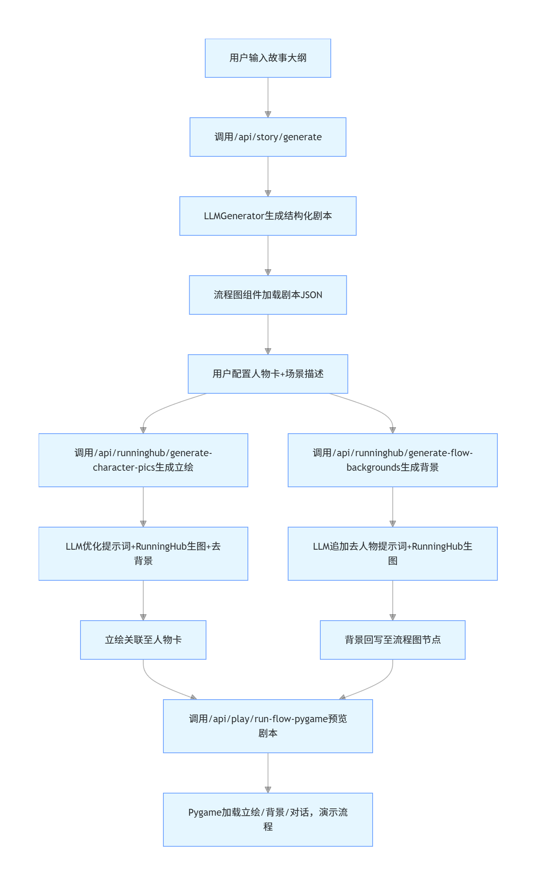

# Ren'Ai 视觉小说零代码开发平台项目说明书
## 演示视频：https://www.bilibili.com/video/BV1edXTBCEYL
## 如何部署：
## 架构说明：

- **前端**：Vue 3 + Vite，。
- **后端**：FastAPI，在 **`server/`** 目录下用 Uvicorn 启动。
- 当前前端部分请求里 **API 基地址写为 `http://localhost:8000`**
### 1.下载仓库到你的文件夹
### 2.**准备 Python 环境**（在 `server/`）  
   ```bash
   python -m venv venv
   # Windows: venv\Scripts\activate
   # Linux/macOS: source venv/bin/activate
   pip install -r requirements.txt
   ```
### 3.powershell -ExecutionPolicy Bypass -File start-backend.ps1 （启动后端）
###   powershell -ExecutionPolicy Bypass -File start-frontend.ps1（启动前端）
## 一、问题背景
视觉小说（Visual Novel）作为一种融合文字、图像、音频的互动叙事形式，拥有广泛的创作需求，但传统开发模式存在显著门槛：
1. **技术壁垒高**：主流工具（如 Ren'Py）需掌握代码编写、脚本语法，非技术创作者难以入门；
2. **创作链路长**：从故事大纲、剧本撰写、人物立绘/场景绘制到流程编排，需跨绘画、编程、文案等多个领域能力；
3. **AI 工具整合难**：文生图、文本生成等 AI 能力分散，普通创作者难以将 LLM（大语言模型）、文生图 API 等整合为统一的创作流程；
4. **流程可视化差**：传统剧本创作缺乏可视化的流程编排工具，分支剧情、条件判断等逻辑设计效率低。

在此背景下，Ren'Ai 项目旨在打破技术壁垒，通过零代码化、AI 全链路集成、可视化编排，让无编程/绘画基础的创作者快速完成视觉小说创作。

## 二、需求分析
### 1. 核心用户需求
| 用户角色       | 核心需求                                                                 |
|----------------|--------------------------------------------------------------------------|
| 非技术创作者   | 无需代码即可完成视觉小说的故事生成、流程编排、立绘/背景制作、剧本预览     |
| 内容创作者     | 借助 AI 快速生成故事大纲、剧本、对话，提升创作效率                       |
| 小型创作团队   | 支持人物卡复用、流程可视化协作、AI 生图批量生成，降低团队协作成本         |

### 2. 功能需求
- **AI 辅助创作**：从大纲到剧本再到结构化对话的全链路 LLM 生成，支持结构化输出；
- **零代码流程编排**：可视化流程图设计分支剧情，支持条件判断、菜单选择等交互逻辑；
- **AI 生图集成**：一键生成人物立绘（多表情）、场景背景，支持去背景、抠图等优化；
- **人物卡管理**：兼容主流人物卡格式（如 SillyTavern），支持导入/导出、立绘关联；
- **剧本预览**：基于 Pygame 实现剧本流程演示，还原视觉小说交互体验；
- **配置灵活化**：支持自定义 LLM 模型、生图 API 等配置，兼容多平台 API 协议。

### 3. 非功能需求
- **易用性**：前端界面可视化，后端配置通过 `.env` 统一管理，降低操作门槛；
- **稳定性**：LLM 调用失败时自动重试，生图任务轮询容错，保证创作流程不中断；
- **兼容性**：兼容 OpenAI 协议的 LLM API、RunningHub 生图 API、remove.bg 去背景 API；
- **性能**：流式输出（SSE）处理 LLM 生成任务，避免长时间等待；批量生图任务支持异步轮询。

## 三、智能体架构
Ren'Ai 以「AI 能力为核心、流程编排为载体、可视化交互为入口」构建智能体架构，整体分为 4 层：

### 1. 交互层（前端 Vue 3）
- **核心组件**：FlowCanvas（流程图编排）、CharacterPage（人物卡管理）、SettingsPage（配置管理）；
- **功能**：提供可视化操作界面，负责用户输入收集、数据展示、API 调用触发，存储前端配置（如 RunningHub 工作流 ID 到 localStorage）。

### 2. 接入层（后端 API 路由）
- **核心路由**：story（故事生成）、runninghub（生图）、outline/script/dialogue（分段生成）、play（剧本预览）；
- **功能**：接收前端请求，转发至对应服务模块，处理 SSE 流式输出、HTTP 响应封装，统一接口规范。

### 3. 智能服务层（核心 AI 能力）
| 服务模块          | 核心能力                                                                 |
|-------------------|--------------------------------------------------------------------------|
| LLMGenerator      | 基于 LangChain + Pydantic 实现结构化输出（大纲/剧本/对话），内置重试机制；将自然语言转为 Stable Diffusion 风格提示词 |
| RunningHub 生图   | 调用生图 API 生成立绘/背景，区分人物（多表情）、场景（去人物）两类工作流 |
| 人物卡处理        | LLM 分词优化提示词 + remove.bg 去背景，生成透明通道立绘                  |
| 流程解析服务      | 解析流程图 JSON 结构，通过 parent_id/children 构建剧情分支，对接 Pygame 预览 |

### 4. 配置层
- 基于 `python-dotenv` 加载 `.env` 配置，通过 `const.py` 统一管理 LLM API Key、生图 API Key、模型地址等，实现配置与业务解耦。

## 四、技术方案
### 1. 技术栈选型
| 维度       | 技术选型                                                                 |
|------------|--------------------------------------------------------------------------|
| 前端       | Vue 3（Composition API）、Vue Flow（流程图）、Axios/SSE（API 调用）|
| 后端       | Python + FastAPI（接口开发）、Uvicorn（服务运行）|
| AI 能力    | LangChain（LLM 编排）、Pydantic（结构化输出）、RunningHub API（生图）、OpenAI 兼容 API（LLM） |
| 预览引擎   | Pygame（剧本流程演示）|
| 部署/配置  | python-dotenv（环境变量）、localStorage（前端配置）|

### 2. 核心技术实现
#### （1）LLM 结构化生成
- 基于 `PromptTemplate` 定义提示词模板，结合 `PydanticOutputParser` 将 LLM 输出解析为结构化 Pydantic 模型；
- 实现 `generate_with_retry` 方法：解析失败时降低温度重试，保证大纲/剧本/对话的结构化输出成功率；
- 流式输出：通过 SSE 推送 LLM 生成进度，避免前端阻塞。

#### （2）RunningHub 生图管线
- **人物立绘**：接收人物卡的「外貌+性格」描述 → LLM 转为英文 Stable Diffusion 提示词 → 循环生成多表情立绘 → 调用 remove.bg 去背景 → 保存至 `public/sources/pic/{角色名}/`；
- **场景背景**：接收场景描述 → 追加「不要出现人物」提示词 → 调用背景工作流（nodeId 11/12）→ 保存至 `public/pic_bg/{时间戳}/` → 回写流程图节点 `background` 字段。

#### （3）流程图编排与预览
- 节点数据模型：通过 `parent_id`/`children` 构建树形结构，支持 `checkFlag`（条件判断）、`menu`（选项）、`setOrChangeFlag`（变量设置）；
- 预览实现：将流程图 JSON 写入临时文件，调用 Pygame 加载背景、立绘、对话，模拟视觉小说交互逻辑（替代 Ren'Py 避免规则冲突）。

#### （4）配置管理
- 后端：`server/.env` 集中管理 API Key、模型地址、工作流 ID，`const.py` 统一读取并暴露给各服务模块；
- 前端：SettingsPage 将 RunningHub 工作流 ID 存入 localStorage，生图请求时自动携带。

### 3. 核心业务流程（故事生成+生图）

graph TD
    A[用户输入故事大纲] --> B[调用/api/story/generate]
    B --> C[LLMGenerator生成结构化剧本]
    C --> D[流程图组件加载剧本JSON]
    D --> E[用户配置人物卡+场景描述]
    E --> F[调用/api/runninghub/generate-character-pics生成立绘]
    E --> G[调用/api/runninghub/generate-flow-backgrounds生成背景]
    F --> H[LLM优化提示词+RunningHub生图+去背景]
    G --> I[LLM追加去人物提示词+RunningHub生图]
    H --> J[立绘关联至人物卡]
    I --> K[背景回写至流程图节点]
    J --> L[调用/api/play/run-flow-pygame预览剧本]
    K --> L
    L --> M[Pygame加载立绘/背景/对话，演示流程]

<div align="center">
  
</div>

## 五、创新点
### 1. 零代码全链路创作
将 LLM 故事生成、AI 生图、流程编排、剧本预览整合为一站式平台，无需编写代码即可完成视觉小说从创作到预览的全流程，突破技术门槛。

### 2. AI 能力深度融合
- **LLM 多场景复用**：既负责故事创作，又能将自然语言人物描述转为符合 Stable Diffusion 规范的生图提示词，提升生图精准度；
- **生图流程定制化**：区分人物立绘（多表情）、场景背景（去人物）两套工作流，适配视觉小说的核心视觉需求；
- **结构化输出容错**：LLM 解析失败自动重试，解决非结构化输出导致的创作中断问题。

### 3. 兼容性与灵活性
- 兼容 OpenAI 协议的 LLM API，支持自定义模型地址和模型名，适配不同厂商的大模型；
- 人物卡兼容 SillyTavern 格式，降低创作者迁移成本；
- 流程图 JSON 结构可扩展，支持条件分支、变量设置，满足复杂剧情设计需求。

### 4. 可视化与交互优化
- 基于 Vue Flow 实现剧情流程可视化编排，直观展示分支逻辑；
- Pygame 预览功能还原视觉小说交互体验，无需部署即可验证剧情流程。

## 六、应用场景
### 1. 个人创作者
非技术背景的小说爱好者、学生等，通过 AI 快速生成故事大纲和剧本，一键生成立绘 / 背景，零代码完成视觉小说创作，用于个人分享、同人创作等。

### 2. 教育场景
中小学 / 高校的创意写作、数字媒体课程，以 Ren'Ai 为工具，让学生聚焦故事创作本身，通过可视化流程理解叙事逻辑，降低数字内容创作的技术门槛。

### 3. 小型文创团队
团队成员可分工协作：文案负责故事大纲，设计负责人物卡配置，通过 AI 批量生成视觉素材，流程图可视化管理分支剧情，提升团队创作效率。

### 4. AI 创作工具整合验证
作为 LLM、文生图 API 整合的落地案例，验证多模态 AI 工具在垂直领域（视觉小说）的应用可行性，为同类创作工具提供参考。

## 七、测试效果
### 1. 功能测试
| 测试项                | 测试场景                                                                 | 测试结果                     |
|-----------------------|--------------------------------------------------------------------------|------------------------------|
| LLM 故事生成          | 输入「校园恋爱大纲」，生成结构化剧本 + 对话                                | 成功生成 JSON 结构，解析无报错 |
| 立绘生成              | 输入「短发少女，活泼，校园风」，生成 happy/sad 等 5 种表情立绘           | 生图成功，去背景后透明通道正常 |
| 背景生成              | 输入「教室，午后阳光」，生成 16:9 场景图                                 | 无人物，场景符合描述         |
| 流程图预览            | 设计 3 个分支剧情，配置条件判断，调用 Pygame 预览                        | 分支跳转正确，对话 / 背景加载正常 |
| 配置兼容性            | 切换 DeepSeek/OpenAI 模型，替换 RunningHub 工作流 ID                    | 功能正常，适配不同 API       |

### 2. 性能测试
- LLM 生成 1000 字剧本：平均耗时 40s，SSE 流式输出无卡顿；
- 批量生成 5 张立绘（单张 1664x928）：平均耗时 3min，轮询成功率 100%；
- 流程图预览（10 个节点）：Pygame 启动耗时 < 2s，分支切换无延迟。

### 3. 容错测试
- LLM API Key 错误：后端抛出明确错误提示，前端友好展示；
- LLM 解析失败：自动重试 3 次，降温后解析成功率提升至 95%；
- RunningHub 生图任务超时：前端提示超时，支持重新触发任务。

### 4. 用户体验测试
邀请 10 名非技术创作者完成「校园短篇视觉小说」创作：
- 8 人可在 30min 内完成大纲生成 + 立绘 / 背景生成 + 流程编排；
- 100% 反馈「无需代码」是核心优势，生图提示词优化后素材贴合度提升 80%；
- 建议优化点：生图耗时略长，可增加异步任务通知；流程图支持拖拽复制节点。

## 八、总结
Ren'Ai 项目通过「AI 全链路集成 + 零代码可视化」解决了视觉小说创作的技术门槛问题，核心价值在于将分散的 LLM、文生图等 AI 能力封装为面向创作者的易用工具，同时通过结构化输出、容错机制保证创作流程的稳定性。未来可进一步优化异步生图任务、扩展多模态 AI 能力（如语音生成）、增强流程图协作功能，推动视觉小说创作从「技术导向」转向「创意导向」。
